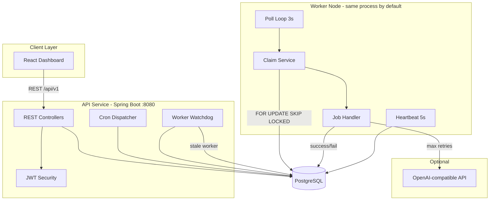
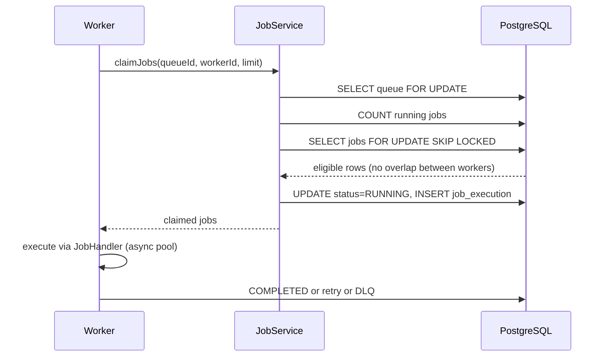

# Architecture

This project follows a classic producer/worker architecture:

- API (Spring Boot) — hosts REST endpoints for auth, projects, queues, jobs, metrics, and DLQ operations.
- Database (PostgreSQL) — stores domain entities; indexed hot paths for claiming.
- Worker (Spring @Scheduled component) — polls queues, claims eligible jobs atomically using `FOR UPDATE SKIP LOCKED`, executes jobs via a pluggable `JobHandler` and writes `JobExecution` rows.
- Frontend (React + Vite) — dashboard for queues, jobs, workers, DLQ and throughput charts.
- Optional AI Summarizer — asynchronous service called on DLQ insert to generate a human summary of failure.

Mermaid deployment diagram:

```mermaid
flowchart LR
  Browser[Browser (React UI)] -->|REST| API[API Service (Spring Boot)]
  API -->|JDBC| Postgres[(Postgres)]
  Worker[Worker Process] -->|REST| API
  Worker -->|JDBC| Postgres
  API -->|async| AISummarizer[(AI Summarizer)]
```

Key flows
- Claiming: Worker polls eligible jobs (status=QUEUED or SCHEDULED && scheduledAt <= now) and uses `SELECT ... FOR UPDATE SKIP LOCKED` to claim up to `N` jobs atomically.
- Execution: Worker transitions Claim->Running, executes via `JobHandler`, writes `JobExecution` and `JobLog`, then completes or schedules retry.
- Retry/DLQ: Jobs are retried per RetryPolicy (fixed/linear/exponential). After max retries, entry moved to DLQ and AI summarizer invoked.

Scalability notes
- Claiming scales horizontally using SKIP LOCKED.
- For very large scale, consider sharding queues or using a distributed lock (e.g., etcd/consul/redis) and add leader election for scheduling.


## Overview

Three cooperating layers:

| Layer | Responsibility |
|---|---|
| **API service** | REST endpoints, auth, project/queue/job CRUD, dashboard metrics |
| **Worker node** | Polls queues, claims jobs atomically, executes via pluggable handler, manages retries/DLQ |
| **PostgreSQL** | Source of truth; transactional consistency for claims and state transitions |



## Claim flow



## Job lifecycle

```
QUEUED/SCHEDULED → RUNNING → COMPLETED
                           ↘ FAILED → QUEUED (retry) → … → DEAD_LETTER
```

Stale workers are detected by heartbeat timeout; in-flight jobs are requeued or escalated to DLQ.

## Frontend

React (Vite) dashboard polls every 4–5 seconds for queue health, jobs, workers, throughput, and DLQ entries. Proxies API calls to `localhost:8080` during development.
