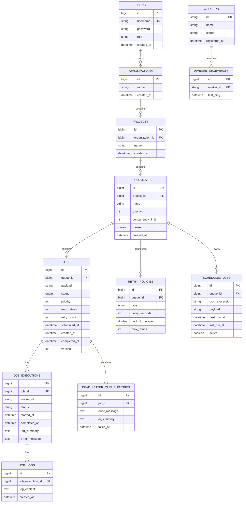

# Entity Relationship Diagram

All foreign keys are indexed. The hot claim path uses composite index `(queue_id, status, scheduled_at)` on `jobs`.

Cascade deletes: `Project → Queue → Job`. Job executions, logs, and DLQ entries are retained when a job row is removed (`ON DELETE SET NULL` on execution FKs).

## Job status enum

`QUEUED`, `SCHEDULED`, `CLAIMED`, `RUNNING`, `COMPLETED`, `FAILED`, `DEAD_LETTER`

## Index summary

| Table | Index | Purpose |
|---|---|---|
| jobs | `(queue_id, status, scheduled_at)` | Atomic claim query |
| jobs | `status` | Dashboard filters |
| queues | `project_id` | Project listing |
| job_executions | `job_id`, `worker_id` | Execution lookup, watchdog |
| worker_heartbeats | `worker_id` | Heartbeat lookup |
| dead_letter_queue_entries | `job_id` | DLQ retry |
